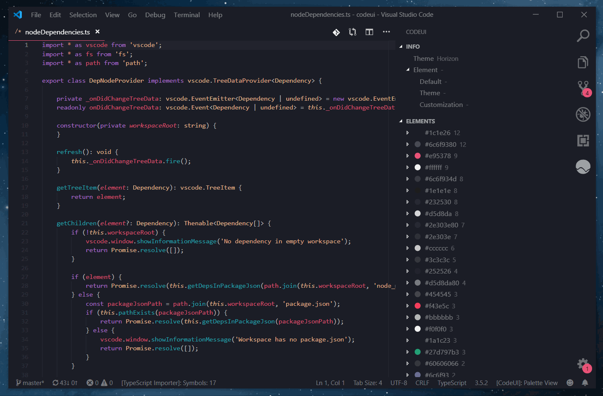

<p align="center">
  <a href="" rel="noopener">
 </a>
</p>

<h2 align="center">CodeUI</h2>

<div align="center">

  []()
  []()

</div>

<p align="center" style="font-size: 150%"> Build, edit, & explore your color theme for VS Code.
</p>

---

## Table of Contents

- [Features](#features)
    - [Interface](#interface)
    - [Colors](#colors)
    - [Customization](#customization)
- [Getting Started <a name = "getting_started"></a>](#getting-started-a-name--getting_starteda)
  - [Installing](#installing)
  - [Usage](#usage)
  - [Extension Settings](#extension-settings)
- [Additional Info](#additional-info)
  - [Release Notes](#release-notes)
  - [Get involved](#get-involved)
  - [Contributors](#contributors)
  - [Technical acknowledgements <a name = "acknowledgement"></a>](#technical-acknowledgements-a-name--acknowledgementa)
  
# Features

### Interface

Browse & customize the elements of VS Code's interface with descriptions and realtime visual representations of your color settings


### Colors

Enter custom values or choose from a set of over 2k preset colors. Easily store your favorites via ```codeui.favoriteColors``` in user settings


### Customization

Darken, lighten, copy & paste values across items. Use Standard or Palette view to sort by element groups or target specific colors- wherever they appear



# Getting Started <a name = "getting_started"></a>

## Installing
The reccomended method for installing CodeUI is via the Extension Marketplace, accessed from within Visual Studio Code.

Alternatively, you can download the VSIX from the repo on [Github](https://github.com/ryanraposo/codeui) and install using the terminal with command: 

```
code --install-extension codeui-0.1.0.vsix
```

*Note: it may be neccessary to reload vscode if installing via the terminal.*

## Usage

Refer to usage documentation [here.](./usage/usage.md)

## Extension Settings

 - ```codeui.showNotifications``` : Toggle various notifications about CodeUI's activity 

 - ```codeui.favoriteColors``` : User-defined colors for use by CodeUI

# Additional Info

## Release Notes 
    (0.1.0) Initial release of CodeUI

        - View & customize the colors of VS Code's interface
        - workbench.colorCustomizations only


## Get involved
Help make CodeUI the standard theming tool for vscode! Whether it's new features, optimizations, documentation or general knowledge - I would very much appreciate your contributions & insights. You can join the project on [Github](https://github.com/ryanraposo/codeui).

Users and developers alike, write to raposo.ryan@gmail.com any time if you have an idea, tip, or comment of any sort. Customizing the UI is a huge part of vscode's charm, and your feedback will help make it as fun & accessible as possible.

Thank you for supporting CodeUI!

## Contributors
  - See [contributors](https://github.com/ryanraposo/codeui/network/contributors) page on GitHub

## Technical acknowledgements <a name = "acknowledgement"></a>
- copy-paste (npm)
- tiny-color2 (npm)
- Various extension development blogs