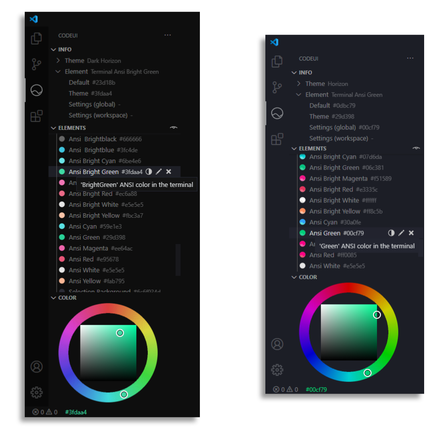

<br/>
<div align="center">
  <a href="" rel="noopener">
  </a>
</div>
<br/>
<div align="center">

  Customize your color theme for VS Code.

  [](http://github.com/ryanraposo/LoveItShipIt)

</div>

# Table of Contents

- [Table of Contents](#table-of-contents)
- [Features](#features)
  - [Interface](#interface)
  - [Colors](#colors)
  - [Customization](#customization)
- [Installing](#installing)
- [Usage](#usage)
- [Get Involved](#get-involved)
  
# Features

## Interface

Browse the elements of VS Code's interface and adjust your color settings in realtime



## Colors

Use the built-in color picker, enter custom values, or choose from over 2k preset colors. Store your favorites via ```codeui.favoriteColors```

## Customization

Apply color customizations by theme and workspace. Darken, lighten, copy & paste values across items. Use Standard or Palette view to sort by element groups or target specific colors wherever they appear

*Note: customizations are applied to the current theme by default. 

# Installing

The recommended method for installing CodeUI is via the Extension Marketplace, accessed from within Visual Studio Code.

Alternatively, you can download the VSIX from [releases](https://github.com/ryanraposo/codeui/releases) and install using the terminal with command: 

```
code --install-extension codeui-0.3.2.vsix
```

*Note: it may be necessary to reload vscode if installing via the terminal.*

# Usage

Refer to usage documentation [here. ](./USAGE.md)

# Get Involved

Help make CodeUI the standard theming tool for vscode! Whether it's new features, optimizations, documentation or bug reports - we appreciate your help. You can join the project on [Github](https://github.com/ryanraposo/codeui).

Customizing the UI is a huge part of vscode's charm. Your feedback and contributions will make it as fun & accessible as possible.

Thank you for supporting CodeUI!
