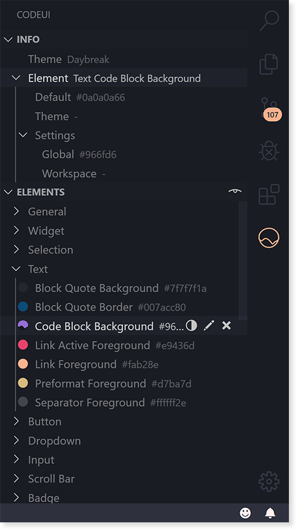

<br/>
<div align="center">
  <a href="" rel="noopener">
  </a>
</div>
<br/>
<div align="center">

Customize your color theme for VS Code.

  []()
  []()
  
  
</div>

# Table of Contents

- [Features](#features)
    - [Interface](#interface)
    - [Colors](#colors)
    - [Customization](#customization)
- [Getting Started](#getting-started)
  - [Installing](#installing)
  - [Usage](#usage)
  - [Extension Settings](#extension-settings)
- [Additional Info](#additional-info)
  - [Get Involved](#get-involved)
  - [Contributors](#contributors)
  - [Acknowledgements](#acknowledgements)
  
# Features

## Interface

Browse & customize the elements of VS Code's interface with descriptions and realtime visual representations of your color settings



## Colors

Enter custom values or choose from a set of over 2k preset colors. Easily store your favorites via ```codeui.favoriteColors``` in user settings


## Customization

Darken, lighten, copy & paste values across items. Use Standard or Palette view to sort by element groups or target specific colors- wherever they appear


# Getting Started

## Installing
The recommended method for installing CodeUI is via the Extension Marketplace, accessed from within Visual Studio Code.

Alternatively, you can download the VSIX from [releases](https://github.com/ryanraposo/codeui/releases) and install using the terminal with command: 

```
code --install-extension codeui-0.3.1.vsix
```

*Note: it may be necessary to reload vscode if installing via the terminal.*

## Usage

Refer to usage documentation [here. ](./USAGE.md)

## Extension Settings

 - ```codeui.showNotifications``` : Toggle various notifications about CodeUI's activity 

 - ```codeui.favoriteColors``` : User-defined colors for use by CodeUI

 - ```codeui.targetingMode``` : Controls target of customizations applied by CodeUI

 - ```codeui.preferredScope``` : Controls default scoping behaviour when a workspace/folder is open

# Additional Info

## Get Involved
Help make CodeUI the standard theming tool for vscode! Whether it's new features, optimizations, documentation or bug reports - we appreciate your help. You can join the project on [Github](https://github.com/ryanraposo/codeui).

Customizing the UI is a huge part of vscode's charm. Your feedback and contributions will make it as fun & accessible as possible.

Thank you for supporting CodeUI!

## Contributors
  - See [contributors](https://github.com/ryanraposo/codeui/graphs/contributors) page on GitHub

## Acknowledgements
- This extension is dedicated to the community at r/vscode.
